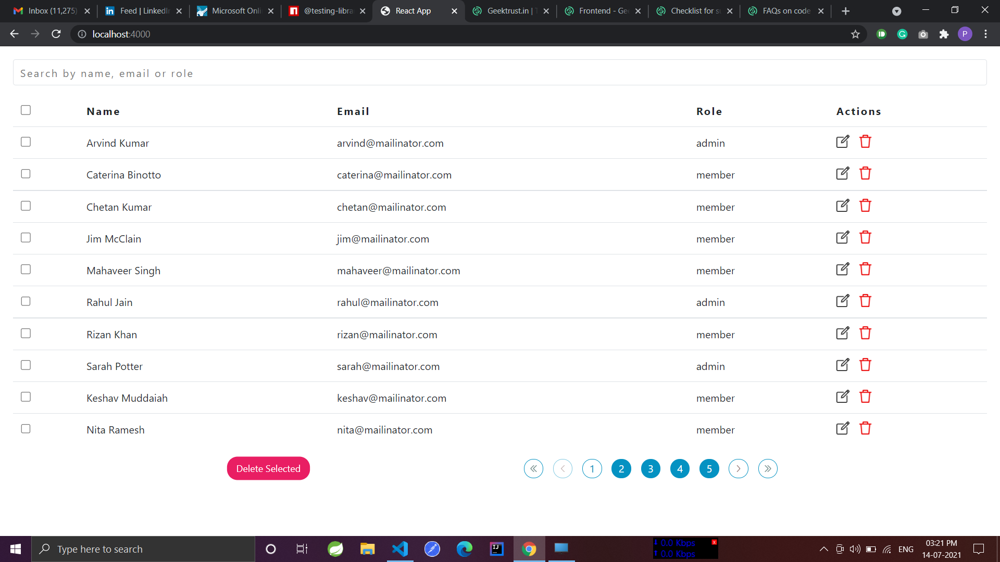
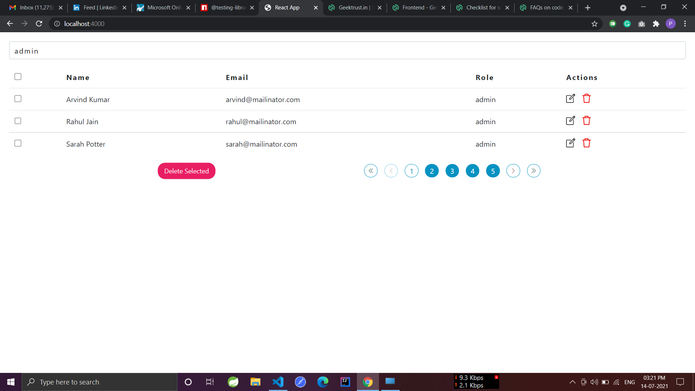
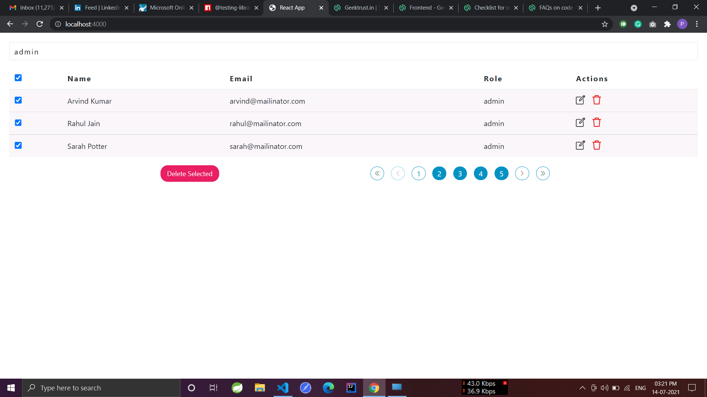
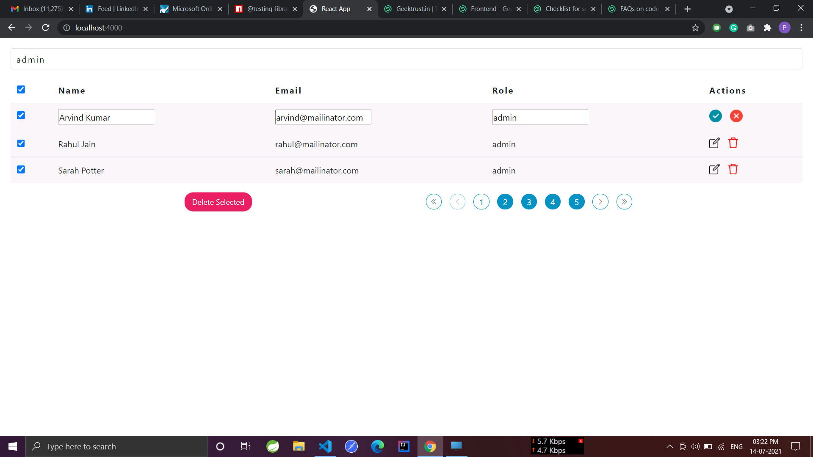

# GeekTrust Admin UI
## Note: This is a **webpack** based React App.

# Steps To Run App
1. Install npm modules using **npm install.**
2. After Successful Installation, you can run app using **npm start.**

# Linting and Formatting
For linting and formatting related you can use following scripts. The linting, formatting configurations are specified in the **.eslintrc.js** and **.prettierrc.yaml**

1.**npm run fix:lint** To fix all linting issues in project.

2.**npm run format** To format line of code using prettier plugin.

# To Run Test Cases 
Use following scripts to run the test cases in different modes.
Used the **react-testing-library** in the project.

1.**npm run test-local test-name** To run all test cases locally.

2.**npm run test-watch test-name** To run test case in watch mode.

# Folder Structure and convention followed in project
1.**components:** For all project related component/pages are created in this folder, they can have respective nested sub components.

2.**style:** For all project related styles and fonts will go inside this folder.

3.**common:** All the utility component or those components which will be used in multiple components will be created inside this folder. such as error boundary, verticalGap etc.

4.**services:** Folder will contain the network related services or the constants which will be used in the project will go here.

5.**config:** It contains webpack and jest related configurations.

## Screenshot

